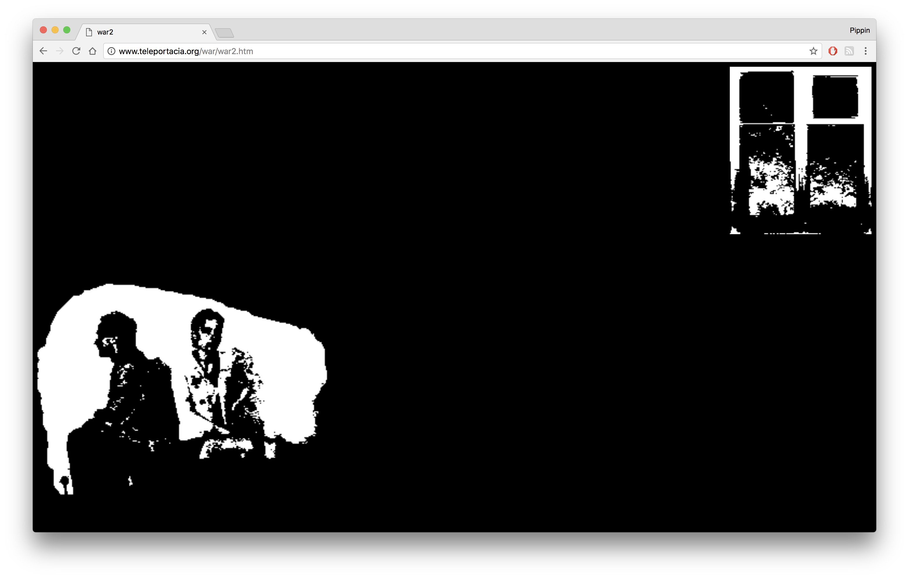
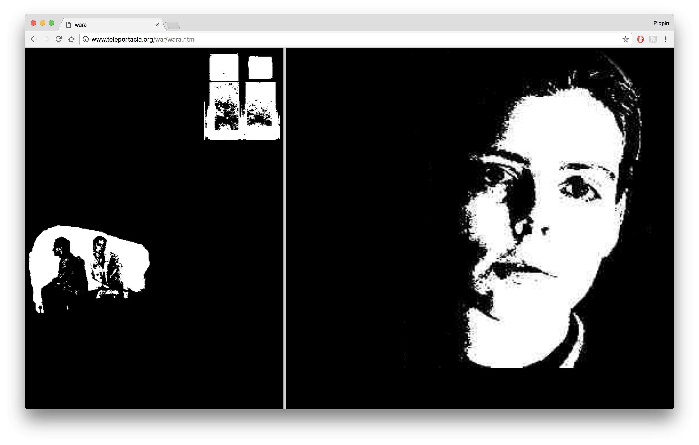
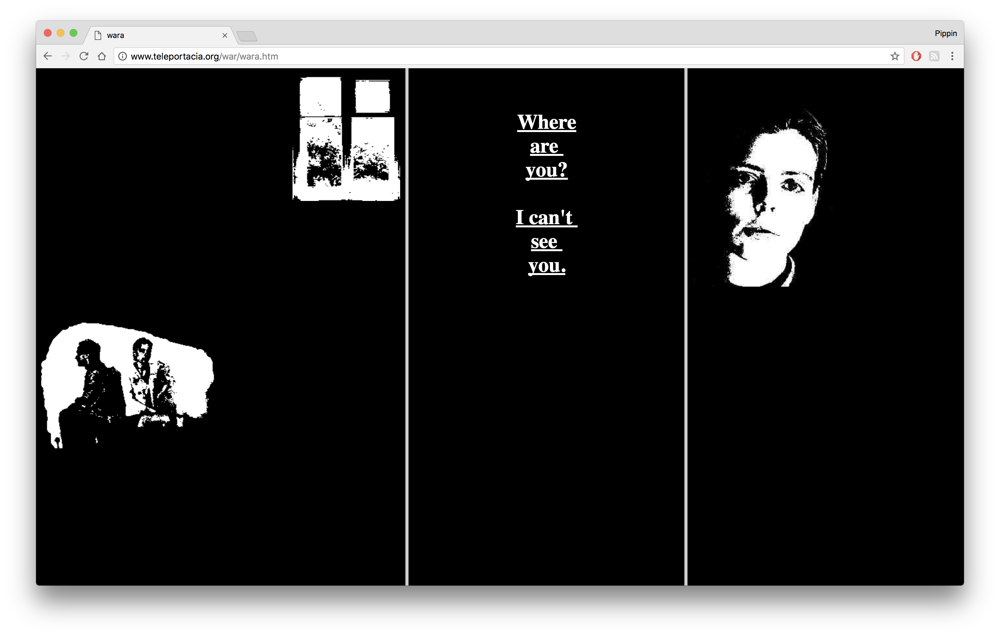
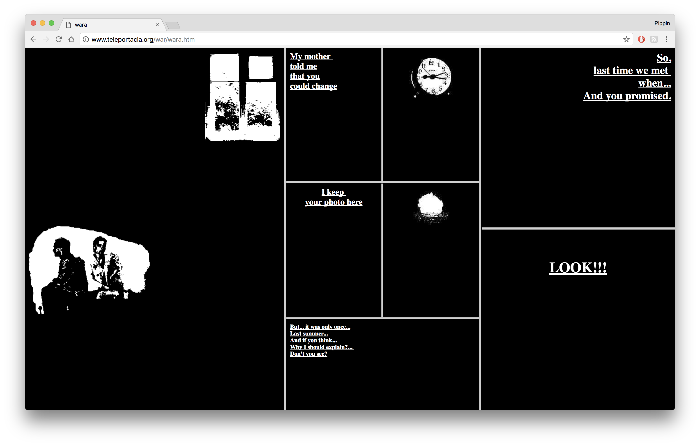
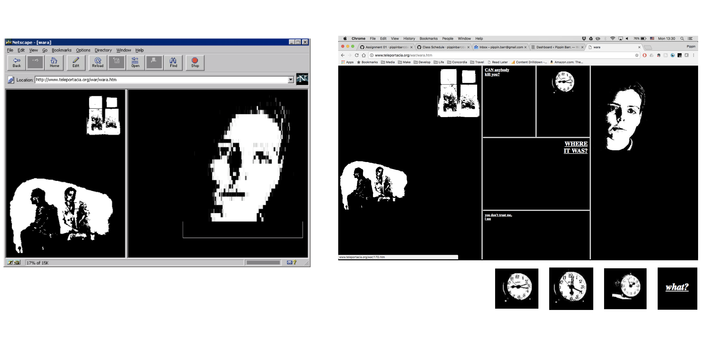
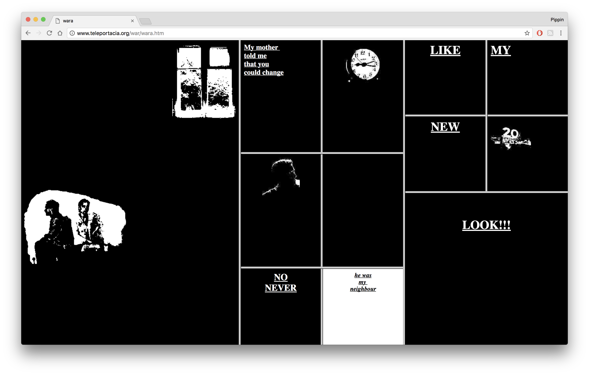

class: middle

## DART 450 | Web Intervention | Week 03
# Expressive webpages

---

class:middle

## http://www.teleportacia.org/war/

???

- From 1996
- One of the very early works of online hypertext, celebrated
- Thoughtfully using the web and (explicitly) its technology expressively
- I’m personally drawn to more formalist accounts in my own work, so that’s where I’ll land -
- But if you have other perspectives and take aways we need to hear them
- For me, big things were: space, time, narrative, cinema, expressivity of technologies, and the death/dying of hypertext/hyperlinks as a form

---

class:middle

???

__Space__
- A really central aspect of Lialina’s work here concerns the use of the webpage not as a document but as a space of visual expression, a canvas (or screen in the cinematic sense perhaps)
- We see her doing things with the space on screen to express ideas, such as the blank space between the couple and the window - the sense of isolation evoked. And then later through spatial montage as the piece grows in complexity.

__Q__ What does the spatial montage do in terms of expressing ideas?

__Q__ How do present day websites use ideas of space relative to their content/expression?

---

class:middle

???

__Cinema__
- Lialina states specifically that she came at her project with the idea of adopting a cinematic language to tell the story. As such she was kind of “adapting” cinematic language to a new medium (the web),
- which is a very interesting and generative design/creation process.

__Q__ What aspects of the story as presented seem to evoke the idea of the cinematic?

__Q__ What aspects of the web could be considered cinematic?

__Q__ What aspects of the web could be considered anti-cinematic?

---

class:middle

???

__Medium specificity.__
- Any given medium has particular ways of representing
- Given that Lialina is working with the web here, she was __thinking explicitly about what the web (and HTML specifically) contributed to how we can convey narrative__.

__Q__ What aspects of the web does Lialina use to extend, critique or alter cinematic language?

__Q__ What aspects of web technology are “special” to the way the story is being told?

__Q__ What effects are specific to the web more generally speaking (relative to cinema? relative to all other media?)?

__Q__ What new aspects does the web include compared to the technology Lialina is using here? Q How could they be used narratively?

---

???

__Technology and expressivity__
- One of the themes explored in the article is Lialina’s ideas around the expressivity of the web.
- The idea it has specific properties that can be used narratively (or in other ways) to communicate.

__Defining Aesthetics__
- An interesting part of the discussion revolves around the __story’s definition of aesthetics__ (using HTML in collaboration with user’s browser).
- Particularly the idea that in those days it was possible (and once desirable) __to leave visual aesthetics undefined__ so that the user could express their own preferences for typography and colours for example.

__Q__ Is this still possible?

__Q__ How does the current use state of HTML/CSS alter/shift the balance of power and aesthetics in our experience of the web? Positives and negatives? Q How do our browser and hardware shape our experience of the web now?

Consider the __example of Lialina’s links always being white__ (no mouse over or visited styling), which __controverts usability__. But there is an artistic direction here - it’s expressive and intentional. Important not to be a slave to convention?

---

class:middle

???

__Pacing__
- The idea of pacing is raised explicitly in connection with the loading times of images.
- But also in terms of the ways that aspects of the page “animate” with clicks.
- User-driven pacing too, in that we choose our times to click

__Q__ How does the story relate to this idea of time (central to narrative)?

__Q__ What other elements of the underlying technology (HTML + web browser) are used expressively?

__Q__ What new aspects of web technology (updated HTML, CSS, JavaScript, libraries) provide new expressive possibilities? How do they do so? Q Why doesn’t there seem to be much narrative presentation of this kind on the internet?

__Q__ What kinds of narratives are being explored now? How?

---

class:middle

???

__Language, hyperlinks__
- A major concern is the idea of net.language - that just as we talk about the language of cinema, the net has a language of expression.
- A central aspect (at the time) of the language of the web was the idea of the hyperlink and the larger structures created through hyperlinking.
- The article connects us back to Vannevar Bush and Tim Berners-Lee in interesting way. Bush had a subjective/narrative understanding of webs of information, for example. Berners-Lee foregrounded the idea of the web as constructed socially.

__Q__ What expressive/narrative powers does a hyperlink have?

There’s some suggestion in the article that hyperlinks (in their traditional sense) are “dying out” as a form (something that has been echoed elsewhere). Do we agree?

__Q__ Are hyperlinks thought of the same way now? What do we use them for?

__Q__ Is the current net.language the same as it was in Lialina’s time?

__Q__ How has it changed? What kinds of things do we “say with the web” these days?
