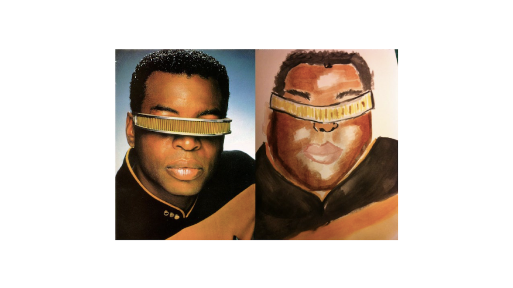

class: middle

# DART 450 | Web Intervention | Week 04
## It's suppose to look like shit: the internet ugly aesthetic

---

???

__Internet Ugly__

- “Although the internet continually matures and offers slicker tools to make amateur work look professional, __users will always reach beyond their technological capabilities. If, for example, software eventually enables any user to create original, professional-looking freehand sketches, some user will misuse it to create a freshly ugly kind of image.__”

---

???

__The New Aesthetic__

- http://new-aesthetic.tumblr.com/
- "For a while now, I’ve been collecting images and things that seem to approach a new aesthetic of the future, which sounds more portentous than I mean. What I mean is that we’ve got frustrated with the NASA extropianism space-future, the failure of jetpacks, and __we need to see the technologies we actually have with a new wonder.__ Consider this a mood-board for unknown products.”
- Often about technology’s perception of the world (and us)

---

???

__Internet Ugly vs. The New Aesthetic__

- Coaxed into a Snafu
- Crappy renditions of the traditional troll face, recaptioned to capture the expression
- “This is the clearest example of how Internet Ugly contrasts with the New Aesthetic: while the __latter explores how computers break down reality__ through pixellation and programming code, the __former shows how humans corrupt ideas through imperfect reproduction__.”
- "In an environment where information can easily be perfectly cut and pasted, users celebrate their human inability to make the same thing twice."

---

???

__Democratization__

- The aesthetic itself __could be called democratic in the way is functions hugely as assemblage__ rather than individual creation (re-using other people’s imagery, work, emotional tone...)
- __“the internet is built to give outsized attention to the amateurish, the accidental, and the surprise hit.”__
- __But also note the personal nature here__ - people telling stories about life

---

???

__Practicing a craft in public: Shitty Watercolor__

- The idea here being that because Internet Ugly is accepting of (and enthused by) “bad art”, you can __get your bad art out of your system publicly as a performance__
- __This may be what people need sometimes to improve their skills__ - an external force of support
- Though also very __strange because eventually you “skill out”__ of the Internet Ugly sphere?

---

???

__Critical satire__

- “These aesthetic choices __effectively critique the bland, safe formulas of their subject__. They rip Sheldon and his fellow characters out of their original context and refuse to provide a sensible new one.”
- Interesting to think about this as satire - it’s pretty relentlessly a form of satire engaged in tearing down how polished and bland media products portray reality?
- __Does it do other things?__
- [4Chan's Version of The big Bang theory](https://imgur.com/a/qVX7b)
- [Custom wall papers](https://imgur.com/a/5wizH)
- [Beautiful sunset outside my door this morning](https://www.reddit.com/r/ShittyEarthPorn/comments/spgbu/beautiful_sunset_outside_my_door_this_morning/)

---

???

__Ugliness as authentic__

- Kind of a __continuation of the idea behind the satirisation?__
- Taking polished media products as a starting point and __destroying them by being “realistic” in this case__
- “Each ‘Nailed It’ image compares an intended result to an actual one (see Figure 11). ... The __more beautiful parts of the internet are thus cast as less real than the parts where people are an incompetent embarrassing mess__.”
- "‘Nailed It’ achieves a major goal of Internet Ugly: to normalize imperfection, counteracting the effect of magazines, TV shows, and corporate websites that use technical tools to build an unattainable simulacrum of the world."

---

???

__Automation and Appropriation__

- “In 2009, __Meme Generator__ (2009–2014) launched, making Advice Animal generation extremely simple for non-Photoshop users, and locking in the aesthetic by setting default text for new memes: centered all-caps white Impact type with a feathered black border, placed comfortably below the top and bottom edges of the image. ... Competitors like Quickmeme (2011–2014) adopted the same standards, and __for the past three years advice memes have been as visually clean and uniform as Facebook pages__.”
- Followed of course the inevitable corporate and political appropriation...
