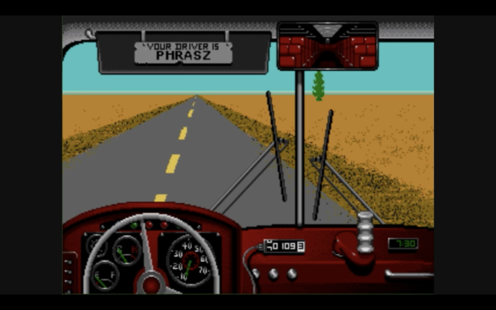

class: middle

# DART 450 | Web Intervention | Week 05
## Abusive design

---

class:middle
## By and large, game design theorists have positioned .codeHighlight[game design as the craft of satisfying players’ desires]

???

- Is this also true of the web? Is it about satisfying the audience? What is it about?
- __Do we efface ourselves when we create our design work__? Are we trying to hide ourselves? Why might this be desirable? What happens if we move in the other direction and foreground ourselves?
- __How does this relate to social media__ and the idea of projecting ourselves through those interfaces?

---

class:middle
## .codeHighlight[Player narcissism] is an extreme but inevitable consequence of user-centered design practices

## this current trend represents an .codeHighlight[intrinsic conservatism in the exploration of the medium and its aesthetic possibilities]

???

- Is this true of web design more generally? __Web user narcissism__?
- Key to see that there’s not __necessarily anything wrong with the developed conventional stance__
- But it is a __limitation of a much larger design space__ that we, as artist-designers, ought to explore.

---

class:middle
## abusive game design is, at its core, about .codeHighlight[spotlighting the dialogic relation between player and designer].

???

- Does this make sense to us?
- Can an interactive system genuinely serve as a proxy for a human?

---

class:middle
## the hope is that .codeHighlight[players are forced out of their expectations] and into an experience in which the importance of understanding the game system is eclipsed by that of .codeHighlight[understanding the designer behind the system].

???

- Much of this design approach has a __focus on breaking down convention__, in order to create a new relationship between player and game (and designer).
- Fits well with the idea of a __personal webpage as intervention__.
- Perhaps in this context rather than try to create interactions that are metaphorically about the designer one could try to create something ambiguous/abusive in such a way that there is a __desire to understand the person behind the system__…

---

## Physical Abuse: Painstation

???

- https://www.youtube.com/watch?v=6bm7fLcj5UI&feature=youtu.be&t=653

- How does this form of abuse make us feel?
- Does this lead us into conversation with the designer?
- I wonder whether these forms of abusive designer really exist more as a form of __conversation with design itself__ rather than a specific designer?
- They allow us to ask why is this game this way? What does it mean?

- __How could this transfer to the web? Can we cause pain?__
- Should we?

---

## Digital (Physical) Abuse: Lose/Lose

???

- https://www.youtube.com/watch?v=YFQp0NJ_ai8

- How does this form of abuse make us feel?
- Does this lead us into conversation with the designer?
- This plays into some of our greatest fears about computers - that just as they give us so much (data, interactivity, connectivity) - they could take it away!
- How could this transfer to the web?
- Difficult, right, because security measures make it a challenge to impact a user’s computer…
- Could try to crash it with an infinite loop, but it’s all sandboxed…

---

## Temporal Abuse: Desert Bus

???

- https://youtu.be/nBr7EhL6Jpg?t=112

- One thing computers are particularly distinct from humans in is their lack of perception of or concern for _time_
- A computer can run the same code over and over until the heat death of the universe, but human experience of time is visceral and immediate
- This contrast can be emphasised by creating scenarios that are intolerable for a human, but "reasonable" in the context of computers and computation
- Does this suggest dialog with the designer or with the _computer_?

---

## Unfair Design: Kaizo Mario

???

- https://youtu.be/r86NLwCYXfk?t=48
- What about this seems conversational/dialogic?
- How does this form of abuse lead us to feel?
- This seems to me the strongest example of abuse and conversation?
- Importantly it’s systemic and it’s very literally a game created to be a dialogue in the first place.
- How could this transfer to the web?

---

## Aesthetic Abuse: Memories of a Broken Dimension

???

- https://www.youtube.com/watch?v=nptXAYlRhFo

- How does this kind of design make us feel? What is the abuse?
- Feels hugely about altering our relationship to the information we need to get our "work" done (or play in this instance) - by disrupting perception, we become less effective and __perception itself becomes a matter of skill/challenge__
- Does this seem dialogic?
- Do we buy the idea that aesthetic abuse can lead us to a sense of dialog with the designer?
(I’m skeptical!)
- How could this transfer to the web?

---

## Social Abuse: Dark Room Sex Game

???

- https://www.youtube.com/watch?v=zFd5DFxKfG8

- What about this seems conversational/dialogic?
- How does this form of abuse lead us to feel?
- Is this a conversation with the designer or with one’s partner?
- With the larger audience?
- Could this apply to the web?
- What about this idea of performative interaction we have here?
- It’s play designed to be witnessed and experienced socially in physical space…
- See also this idea of synergies of abuse - any given category here isn’t totalising, it’s a possible strategy that could be combined with others.
