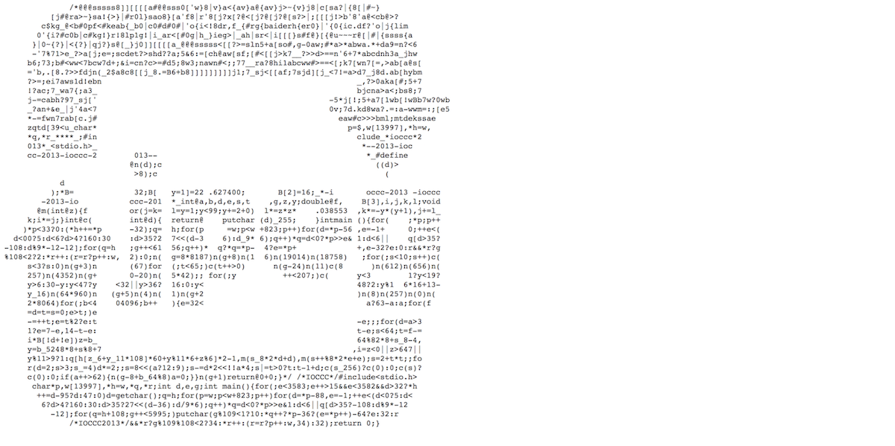

class: middle

# DART 450 | Web Intervention | Week 06
## Functions, style, debugging, plugins

---

class:middle
# Functions

---

# Programs get big

- As you may already have experienced, your code can get quite long.
- When your code gets long it can get harder and harder to understand.
- So we need some way to break our code up into smaller, understandable pieces.
- And that is what functions are for.

---

# functions

- You use functions all the time when programming already.
- jQuery’s `.css()` is a function, for example.
- We know that is just means "set the CSS of the currently select element(s) to what I specify"...
- ... but of course it’s hiding a huge amount of code underneath from us to actually achieve that.
- Which is good! (We would rather not know how it works!)

---

# Being on a need-to-know basis

- Very often in programming, we, the programmer, are on a need-to-know basis.
- There’s a huge amount going on behind the scenes we simply don’t know or particularly want to know (like the specifics of how jQuery sets CSS for example).
- It is similarly helpful to __hide details from ourselves__ to reduce complexity.
- That way, we can focus on exactly what we’re doing, and not all the messy details.

---

# Being on a need-to-know basis

- We kind of do this already with variables.
- We hide the specific value being used behind a name so that we don’t have to think about the specific values, but instead the idea that the values represent.

---

# Being on a need-to-know basis

- Along with the values hidden by variables, we can hide code itself from ourselves by using `function`s.
- So that we can write something like

```
makeAwesomeWebpage();
```

- And it goes off an makes an awesome webpage and we don’t need to worry about the details.
- (Even if we actually wrote the details ourselves earlier.)

---

# Red square

- Imagine we like the idea of adding red squares in random locations to our webpage
- We could write some code like this

```
$(document).ready(function () {
  $(document).on('click',function () {
    var $square = $('<div></div>');
    var x = Math.floor(Math.random() * $(window).width());
    var y = Math.floor(Math.random() * $(window).height());
    $square.css({
      position: 'absolute',
      top: y + 'px',
      left: x + 'px',
      width: '100px',
      height: '100px',
      backgroundColor: 'red'
    });
    $('body').append($square);
  });
});
```

---

# Defining a function

- That worked fine, but one way to keep our code _tidy_ is to move related blocks of code, like the code for drawing a red square in a random location, to its own `function`
- Which could look like this...

---

# `addRedSquare`

```
$(document).ready(function () {
  $(document).on('click',function () {
    addRedSquare();
  });
});

function addRedSquare() {
  var $square = $('<div></div>');
  var x = Math.floor(Math.random() * $(window).width());
  var y = Math.floor(Math.random() * $(window).height());
  $square.css({
    position: 'absolute',
    top: y + 'px',
    left: x + 'px',
    width: '100px',
    height: '100px',
    backgroundColor: 'red'
  });
  $('body').append($square);
}
```

---

# `function`

- As you can see, a function basically gives a _name_ to some lines of code and allows us to _call_ that name when we want those lines to happen
- We define our function with this syntax

```
function addRedSquare() {
  // Code to add a red square
}
```

- That is, we write the word `function` because we're defining a function
- Then we write the _name_ of the function (it should be short while also explaining what the function _does_)
- Then we write parentheses (empty in this case)
- Then inside curly brackets we write the lines of code this function executes

---

# Calling a `function`

- Now in our _click_ event instead of writing out all the lines of code for adding a red square, we can _call_ the function

```
$(document).ready(function () {
  $(document).on('click',function () {
    addRedSquare();
  });
});
```

- We write the _name_ of the function, and then the empty parentheses
- When the program is running, when it sees `addRedSquare();` it _jumps_ to the definition of the function and runs the code in there
- Then jumps _back_ to where it was and continues

---

# Events are handled by functions

- We have seen how whenever we write _event handlers_ in jQuery, like for a 'click' or a 'mouseover' or a 'keypress' we have put the code to run inside `function() { ... }`
- That's called an _anonymous function_
- Given that event handlers use _functions_ to decide what to do, we can simplify our previous code by just giving our new function directly to the handler:

```
$(document).ready(function () {
  $(document).on('click', addRedSquare);
});
```

- Note that when we are giving the function as _information_ like this, we _don't_ include the parentheses after the function name

---

# Functions for organisation

- So functions are great for _organising_ our code by keeping different actions in different _named_ places in our file
- We could make our red square code even more `function`-y by having a function that is called by `$(document).ready()`...

```
$(document).ready(setupPage);

function setupPage() {
  $(document).on('click', addRedSquare);
}
```

- So organised!
- Notice how it starts to make our code much more _readable_. It kind of explains what it does in "plain" language

---


# Functions for reuse

- Along with their organisational superpowers, functions allow us to _reuse_ code we've written, rather than write it out again
- Consider the case where we want to _also_ draw a red square whenever we press a key
- In the old version without functions we'd need something like this...

---

```
$(document).ready(function () {
  $(document).on('click',function () {
    var $square = $('<div></div>');
    var x = Math.floor(Math.random() * $(window).width());
    var y = Math.floor(Math.random() * $(window).height());
    $square.css({
      position: 'absolute',
      top: y + 'px',
      left: x + 'px',
      width: '100px',
      height: '100px',
      backgroundColor: 'red'
    });
    $('body').append($square);
  });
  $(document).on('keypress',function () {
    var $square = $('<div></div>');
    var x = Math.floor(Math.random() * $(window).width());
    var y = Math.floor(Math.random() * $(window).height());
    $square.css({
      position: 'absolute',
      top: y + 'px',
      left: x + 'px',
      width: '100px',
      height: '100px',
      backgroundColor: 'red'
    });
    $('body').append($square);
  });
});
```

---

# Using a function!

```
$(document).ready(function () {
  $(document).on('click',addRedSquare);
  $(document).on('keypress',addRedSquare);
});

function addRedSquare() {
  var $square = $('<div></div>');
  var x = Math.floor(Math.random() * $(window).width());
  var y = Math.floor(Math.random() * $(window).height());
  $square.css({
    position: 'absolute',
    top: y + 'px',
    left: x + 'px',
    width: '100px',
    height: '100px',
    backgroundColor: 'red'
  });
  $('body').append($square);
}
```

---

# Functions do more than this!

- Functions can do more than just break our code up into named parts
- They can take _parameters_ which means we can give _information_ to the function to help it do its job (we use this all the time in jQuery, like when we give `.css()` the CSS properties to set)
- And they can also _return_ information back out when they're being used to calculate something or perhaps create something (like when we write `var $div = $('<div></div>');` - jQuery is _returning_ a div that we then put in our variable)
- However, for the moment we'll just stick with functions for organisation!

---

class:middle
# Programming (with) style

---

# Formatting

```
function stupidFunction () {
  
  var myNumber = 10;
  
  if (myNumber < 20) {
    
    console.log(“Yessss!”);
  
  }

}
```

- This is a stupid function, _but_ it is properly laid out with nice indenting and use of white space

---

# !Formatting

```
function stupidFunction (){
var myNumber=10;
  
if (myNumber <20) {
    
console.log(“Yessss!”);
  
         }
        
  }
```

- This is not.
- Notice how much _harder to read_ this is
- Format your code nicely
- In Atom you can auto-indent by selecting your code and going to `Edit > Lines > Auto indent`
- Or you can type `Command-Shift-P` and type `auto` to select `Auto indent` and press `Enter`

---

# Dear god



- The international obfuscated C code competition
- http://www.ioccc.org/

---

# Commenting

```
$(document).ready(function () {
  
  // If they click the title
  
  $('.title').click(function () {
    
    // Set its background-color to red
    
    $(this).css({
      
      backgroundColor: "red"
    });
  
  });

});
```

- This is reasonably commented
- Comments should explain what the code does in a simple fashion. Think about someone else reading your code and how you could help them understand it easily.

---

# Too specific

```
$(document).ready(function () {
  
  // Use jQuery’s .click() function to add
  
  // a click handler to the title class...  
  $('.title').click(function () {
    
    // Use jQuery’s .css() function to set the
    
    // CSS property 'background-color' to the
    
    // value of 'red'    
    $(this).css({
     
      backgroundColor: "red"
    
    });
  
  });

});
```

- This is probably excessive and it's _much_ too specific, it basically repeats the code itself.

---

# When and where to comment

Use comments to:

- __Explain what your overall script does__ in a comment at the top of the script file. (This is also true for your HTML and CSS files, which should have a comment identifying the project and what the file contributes to it.)
- __Explain what a function does__ in a comment just before the function
- __Explain what a complicated line (or lines) of code does__ in a comment just before the line or lines.

---

# Naming functions, variables, and files

```
function addCatImage() {
  
  var $image = $('');

  $image.attr({
    
    id: "cat",
    
    class: "cuteImage",
    
    src: "images/cat.png"  
  });
  
  $('#cats').append($image);
}
```

- It’s debatable whether you really need comments to explain this, given how clear it is from the code itself.
- Nonetheless, generally speaking please do add comments even in relatively straightforward cases.

---

# Bad naming

```
function lol() {
  
  var d = $('');

  d.attr({
    
    id: "crdr",
    
    class: "zmm",
    
    src: "fk/blz.png"  
  });
  
  $('#jkls').append(d);
```

- This is exactly the same code and will run just as well (assuming you used that terrible filename), but is now much, much harder to understand.

---

# All together now...

```
function lol(){
var d=$('');
d.attr({
id:"crdr",
class:"zmm",
src:"fk/blz.png"});
$('#jkls').append(d);
```

- This is also the same code and will run just as well
- But holy crap
- So you can see that we need commenting, formatting, and naming working together to make our code legible.
- Certainly for other people, but really most of all for ourselves!

---

class:middle
# Debugging

---

# Bugs

- A "bug" is basically any problem with your program. There are various ways these problems can arise, but there are two basic categories:

  1. Sometimes you’ve written code that JavaScript doesn’t understand, so your program just won’t run at all.
  2. Sometimes you’ve written code that JavaScript understands, your program runs, but it doesn’t do what you thought it would.

- Both of these situations require "debugging", the set of techniques and process for fixing bugs.

---

# Debugging

- It would be nice if you didn’t have to spend much of your life with programming debugging...
- ... but, instead, you will spend most of your programming life debugging.
- In a sense, debugging is most of what programming is. Sure, you write some code up front, but then most of the process is trying to get that code to actually do what you wanted.
- This being the case, it’s a good idea to at least try to enjoy debugging if you can.
- It’s kind of like a murder mystery?

---

# Bugs and JavaScript

- We talked briefly early on about how "easy going" JavaScript is in terms of accepting what you do with it.
- A `var` can contain any value, for example, and you don’t always have to end every line with a semicolon.
- This will now come back to haunt us, because if JavaScript doesn’t officially complain to us about our programming, it can be significantly harder to work out what's wrong.

---

# Semicolons

- As we know, you don’t always have to use a semi-colon at the end of the line. This is fine:

```
var one = 1
```

- But that’s not always the case. Sometimes you do have to include semi-colons or you’ll get an error, like in `for` loops:

```
for (var i = 0; i < 10 i++) {
  
}
```

__Uncaught SyntaxError: Unexpected Identifier : 1__

---

# Non-existence: functions

- JavaScript (like most programming languages) cares a lot about spelling and is case sensitive. If you get something even a little wrong, it will get confused.
- Making some kind of typo will lead to JavaScript telling you things don't exist...

```
setTimout(function () {
    
  console.log(“Hello!”);
  
}, 1000};
```

__ReferenceError: setTimout is not defined : 1__

---

# Non-existence: functions

- If you’re using those special functions that are part of libraries, you’ll get a slightly different error message if the function doesn’t exist:

```
var r = Math.randm();
```

__Uncaught TypeError: Math.randm is not function : 1__

---

# Non-existence: variables

- Variables are a much more difficult problem in JavaScript because it often doesn’t care if you spell something wrong:

```
var myNumber = 10;

myNmber = myNumber + 1;
```

- Here we’re trying to change the value in myNumber but we mistyped it.
- Rather than complain, JavaScript will create a _new_ variable called `myNmber` and keep going!
- This is also true with case sensitivity. `mynumber` is not the same as `myNumber`.

---

# Non-existence: variables

- JavaScript does notice if you try to use a variable that’s not defined though:

```
var bigger = 10;
  
bigger = bigger + smaller;
```

__Uncaught ReferenceError: smaller is not defined. : 2__

---

# Wrong type of value in a variable

- A consequence of variables just being declared with `var` is that JavaScript never knows what type of thing you _meant_ to have in that variable.
- Which means it can’t tell if you get it wrong!

```
var myNumber = true;
```

- This will not cause an error because JavaScript doesn’t care what you put in a variable. Even over time...

```
var myNumber = 10;
...

myNumber = "Ten";

...
myNumber = false;
```

- This is all fine in JavaScript, but obviously could screw you.

---

# Wrong type of value in a variable

- It's even weirder because JavaScript will even try quite hard to keep going when you have stupid values in your variables:

```
var myNumber = true;
  
var mySecondNumber = 10;
  
var myThirdNumber = myNumber + mySecondNumber;
```

- What is in myThirdNumber?
--

- `11` - Because JavaScript will try to convert values to "make it work". `true` becomes `1` in this case.

---

# Curly brackets. Oh no.

- You’ve probably already experienced the pain of forgetting a curly bracket or having one too many.
- One too many is usually not too bad...

```
function sayHello () {
  
  console.log(“Hi”);
}

}
```

__Uncaught SyntaxError: Invalid or unexpected token : 3__

(At least it points out what it wasn’t expecting with a line number. In this case the extra curly bracket.)

---

# Curly brackets. Oh no!

- One too few can be substantially more confusing...

```
function sayHello () {
  
  console.log(“Hi”);

```

__Uncaught SyntaxError: Unexpected end of input : 2__

If our function above is the only thing in our script, then the problem is that the program gets to the end of the code and never finds the final matching curly ... so it’s surprised to be at the end of the input, and it tells you.

---

# Curly brackets. Oh god!!

- It gets worse...

```
function sayHello () {
  
  console.log(“Hi”);



function sayGoodbye () {
  
  console.log(“Goodbye”);

}
  

```

__Uncaught SyntaxError: Unexpected end of input : 6__

Same problem, but now the line number doesn’t really tell us where the problem is! Argh! Always match your curlies!

---

# Parentheses...

- Parentheses similarly need to match correctly or you have problems:

```
function sayHello () {
  
  console.log(“Hi”;

}
```


__Uncaught SyntaxError: missing ) after argument list . : 2__

This one is actually totally accurate! It literally tells you where the problem is and what the problem is. Tragically unusual though.

---

# Parentheses... :(

```
function sayHello ( {
  
  console.log(“Hi”);
}
```


__Uncaught SyntaxError: Unexpected token . : 2__

This error message really isn’t very helpful. It doesn’t even give us the line number where the problem is. So, often we have to think about the line number as possibly being “near” where the problem is...

---

# Parentheses... :( :(

```
function sayHello () {
  
  console.log“Hi”);
}
```


__Uncaught SyntaxError: Unexpected string . : 2__

This one is more helpful, but you can see how variable the response to the “same problem” can be. This is just another missing parenthesis, but a new error message...

---

# Parentheses D:

```
function doLoop() {
  
  for var i = 0; i < 10; i++) {
  
    console.log("Loop!");
  }

}

```

__Uncaught SyntaxError: Unexpected token var : 2__

You start to get the picture though. Much of the time a bug exists because the program contains something JavaScript didn’t expect.

It will tell you the thing it didn’t expect, but that may not the be actual cause of the problem.

---

# === versus =

- Don’t forget that === and = do very different things!

```
var myNumber === 4;

```

__Uncaught SyntaxError: Unexpected token === : 1__

That’s a helpful error message!

---

# === versus =

```
var myNumber = 10;

if (myNumber = 15) {
  
  console.log(“Yay!”);

}
```

Oh no, this just prints out “Yay!”. Why???

--

It's because it evaluates `myNumber = 5` as if it’s a condition, and it turns out that `myNumber = 5` is equivalent to just `5`, and any number that is not `0` is `true`!

---

# And so many more!

- There are plenty more wonderful kinds of errors and bugs that can come up in your program.
- It’s a bit of a painful process, but you get better and better at working out what they are from the error messages or behaviour of your program.
- And you get better and better and preventing them with careful programming and good style.
- Some thoughts...

---

# The console!

- If your program is not working at all, or not in the way you expect, the very first thing you should do is open the developer tools in the browser and look at the JavaScript Console.
- The chances are high that there will be a nice red error message sitting there to help you begin to work out what’s wrong.
- Take special note of the _line number_ in your script that is being complained about and start out by looking there in your code, you may spot the problem right away!

---

# Simplify

- If you have an error or some strange behaviour and you can’t work out what’s causing it, try to “comment out” parts of your code and see if the problem goes away.
- If it does, you know the problem was occurring in the code you temporarily removed.
- In the extreme case, you can comment out everything and then slowly add things back in line by line.
- I have had to do that before.

---

# Keep talking (to yourself)

- Despite coding for years, my number one approach to debugging remains sending myself messages in the code.
- That means adding `console.log()` lines all over the place reporting information about the state of my program as it runs.
- I most often do this to report the values in variables while the program is running, to see if they make sense.
- I also use this to print something when a particular function gets run (if I’m worried it’s not being called, or it’s being called too much, say).

---

# More eyes

- Ask someone to take a look at the code with you.
- Often just the process of explaining the problem and the code involved to someone else will cause you to realise what’s going on.
- As an added bonus, the other person may simply be able to see something that you don’t because you’re “in too deep” whereas they’re not stressed about your code not working.
- You can even do this with yourself to some extent by slowly explaining your own code to yourself, line by line.

---

# Relax?

- If you’ve been slamming into a debugging wall for too long, take a break.
- It can be hard to tear yourself away because you desperately want to solve the problem, but a break can give you some distance from the work and help you to realise what’s going on when you return.
- Or even while you’re away!

---

# More sophisticated debugging tools

- Browsers have debugging tools built into them.
- They’re quite sophisticated and to be totally honest I only rarely use them.
- In Chrome, if you go to the Sources tab when you’ve brought up the Developer Tools, you’ll see a whole lot of possible tools, including:

  * The ability to pause your program.
  * The ability to set “breakpoints” in the code that will automatically pause your program when it reaches that line.
  * The ability to “watch” specific expressions, like the value of a variable or some conditional statement.

---

class:middle
# jQuery plugins

---

# Plugins

- One of the great things about programming is how much has _already been done for us_
- jQuery is a great example of this - it provides us with the ability to manipulate elements on a page, react to events, and more, without having to write the underlying code
- jQuery itself can be _extended_ with jQuery plugins, which add extra new powers
- A search for 'jQuery plugins' online will find you a bunch
- For now let's just look at one to get the idea: blast.js

---

# blast.js

- http://velocityjs.org/blast/
- blast.js is a jQuery plugin that can automatically break texts up into pieces with `span` tags around them so we can manipulate the pieces individually
- So, for instance, we could break a paragraph of text up such that every single character is surrounded by `span` tags...
- So for example...

---

```html
<div>
Hello!
</div>
```

becomes

```html
<div>
<span class="blast">H</span>
<span class="blast">e</span>
<span class="blast">l</span>
<span class="blast">l</span>
<span class="blast">o</span>
<span class="blast">!</span>
</div>
```

which would be really boring to do manually, especially for long texts!

---

# Using blast.js

- When it comes to jQuery plugins, there's a standard process to follow
- Most importantly, we want
  - The _documentation_ so we know how to use it
  - The _library itself_ as a `.js` file we can put in our `js/` folder
- So for blast.js we go to the website: http://velocityjs.org/blast/
- We see there is documentation there already, handy!
- Then we have to get the file...

---

# Getting blast.js

- We see a link to _GitHub_ so we click that to go and get the library!
- In this case we click the file in the repository called `jquery.blast.min.js` (that's the library)
- Then we click `Raw` to get the text file version of the library
- Then we _save_ that file to our computer
- We put the file in the `js/` folder of our project
- And we _link_ to the library with a `<script>` tag in `index.html`:

```
<script src="js/jquery.blast.min.js" content="text/javascript"></script>
```

- Now we're ready to actually use it!

---

# Examples

- `examples/week06/basicblasting` shows examples of the basic idea of breaking texts into characters, words, and sentences
- `examples/week06/keyblasting` is an example of using blasting to be able to make characters on the page react to keypresses
- `examples/week06/randomblasting` uses blasting to create a (bad) random ransom note effect

---

# Let's debug a thing?

- I have a devastatingly broken project available for us to debug
- It's in `examples/week06/uglyandbroken`
- (As a "bonus" it includes the other uses of functions we haven't looked at in case anyone wants to play around with them)
