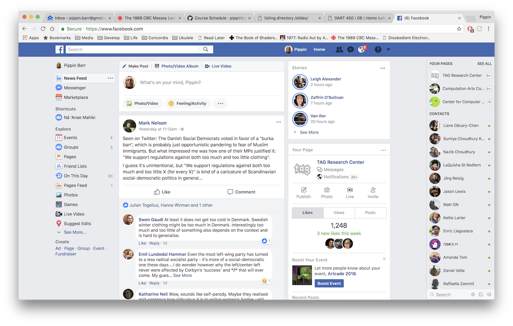
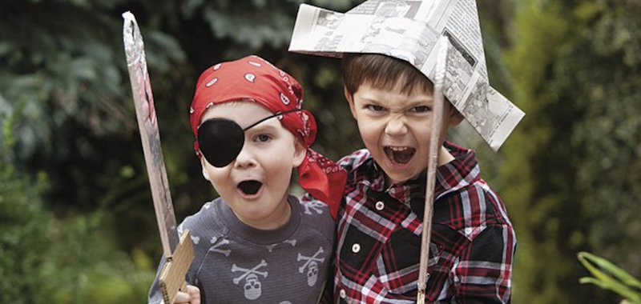
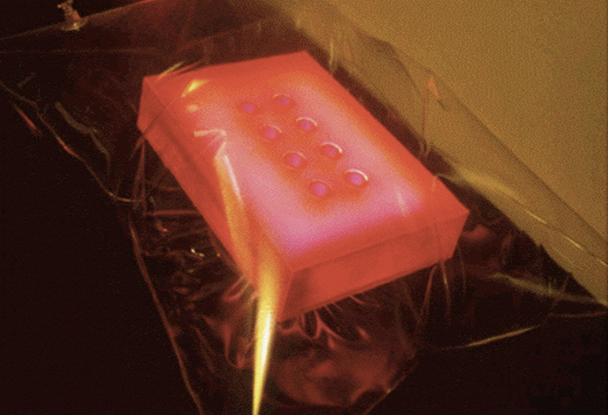
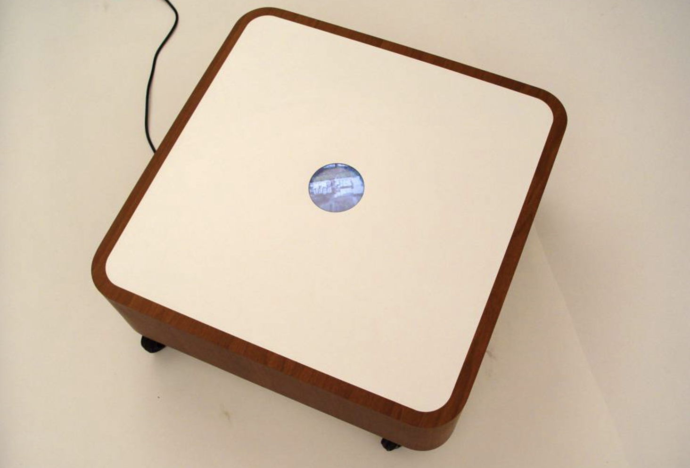
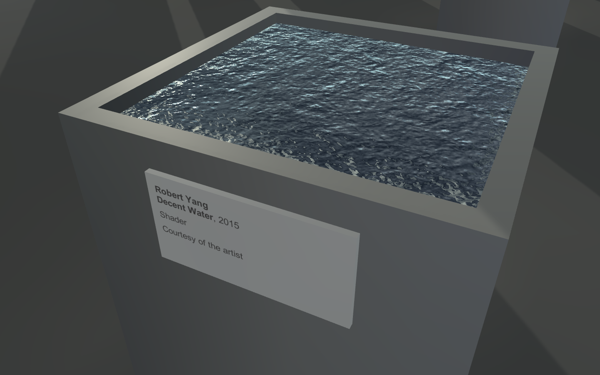

class: middle

# DART 450 | Web Intervention | Week 06
## Homo ludens

---

class:middle
### .hi[As computing has emerged from the office and laboratory, it seems to have brought along values of the workplace]: concerns for clarity, efficiency and productivity; a preoccupation with finding solutions to problems.

---

class:middle

### It is as if they mirror .hi[only the ethnographic view that ordinary life requires work to achieve], and neglect the joyful, poetic, and spiritually rewarding nature of the lives we might find.

---

class:middle

### Is Facebook like a productivity application?

???

- As such, can we read Facebook as a “productivity” interface?
- What aspects of Facebook are work-like? How? Why?

---

class:middle

### "Play is not just mindless entertainment, but an essential way of engaging with and learning about our world and ourselves — for adults as well as children."

???

- The dictionary: "engage in activity for enjoyment and recreation rather than a serious or practical purpose."
- Gaver: "As we toy with things and ideas, as we chat and daydream, we find new perspectives and new ways to create, new ambitions, relationships, and ideals. Play goes well beyond entertainment: it’s a serious business."

---

class:middle

### Is Facebook like a toy?

???

- As such, can we read Facebook as a playful interface?
- What aspects of Facebook are work-playful? How? Why?

---

class:middle

### _The Pillow_ by Anthony Dunne

???

- "The Pillow, by Tony Dunne, glows in response to ambient electromagnetic radiation. It may be greeted as an aesthetic object, a new kind of radio, or as a tool for electronic voyeurism."

- What do you do with this?
- Why does it have this form?
- How is this playful?
- Who would use this?
- When would you use it?

---

class:middle

### _The Drift Table_ by Bill Gaver

???

- A table that has a small viewport through which one can see satellite imagery. The camera moves in the direction of the centre of mass of objects on the table.

- What do you do with this?
- Why does it have this form?
- How is this playful?
- Who would use this?
- When would you use it?

---

class:middle

### _v r 3_ by Pippin Barr

???

- http://www.pippinbarr.com/2017/03/29/v-r-3/
- A presentation of water technology as an object of aesthetic appreciation
- Repositioning a technical element of videogame engines from being a part of the scenery that you generally move through as a tactical environment into being a specific focal point
