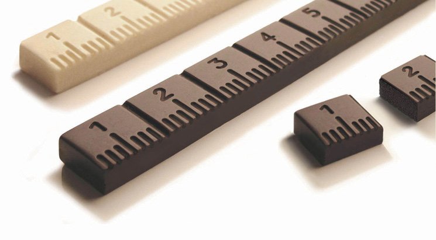
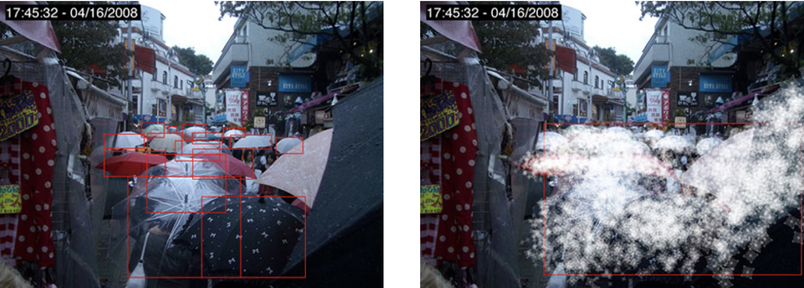
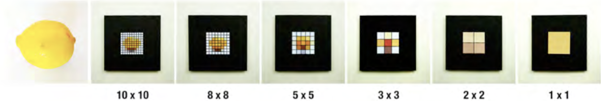
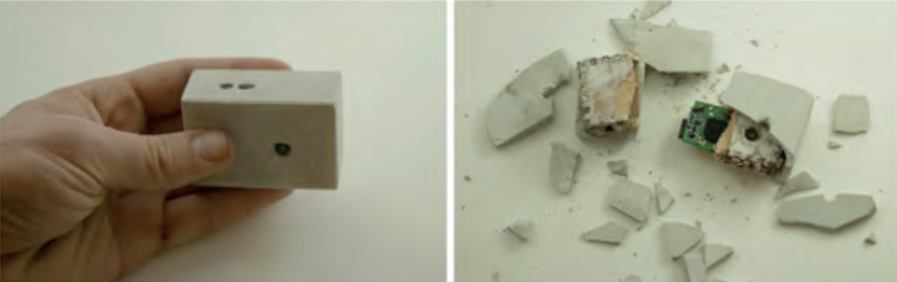
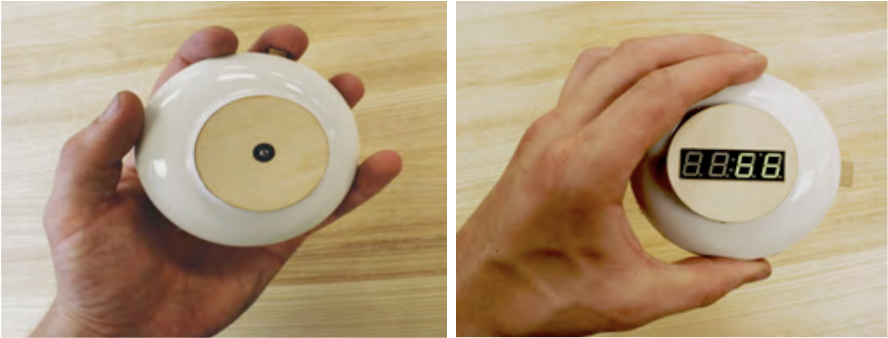
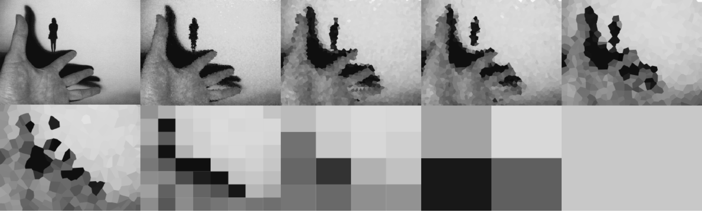
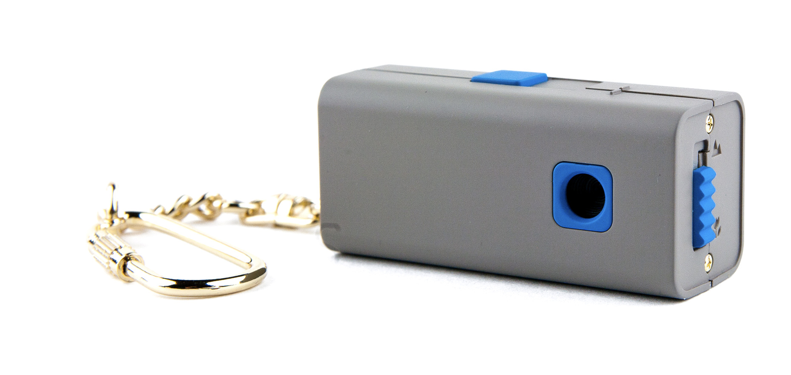

class: middle

# DART 450 | Web Intervention | Week 07
## Counterfunctional things

???

- Pierce, James and Paulos, Eric (2014). Counterfunctional Things. Proceedings of the 2014 conference on Designing Interactive Systems (DIS).
- DIS is a really worthwhile conference to look up if you’re interested in interaction design.

---

class:middle
### .hi[Counterfunctional thing]
### a thing that figuratively counters some of its own “essential functionality”

???

- “Designing digital technologies around extreme functional limitations can be a valuable source of new positive possibilities.”
- So in large part this is almost like a __formal experimental design__ (a little like Oulipo?) where you decide to design ‘against the grain’ as it is perceived conventionally
- with the expectation that you might therefore come across __unexpected design possibilities__
- “Functional opposition can to work to make what is familiar bizarre, surprising and amusing.”
- Distancing ourselves from convention and automatic responses can help us to see technology (or any design object in a new light)

---

class:middle

### .hi[Golosimetro] by Paolo Ulian

???

- “Counterfunctional chocolate”?
- It seems to __negate/complicate the pleasure of eating chocolate by carefully metering how much you’ve consumed__, raising the spectre of diets.

- Can we come up with a __related idea for the web__?
- Seems most connected to ideas around __(over)consumption of web content__?
- Would it be helpful to be made aware of our consumption more explicitly?
- __Are there tools__ that check these sorts of things, or offer to limit us?
- The idea of the __quantified self__ has been popular for a while (but note how the chocolate could be read as critical of the act of quantification itself potentially? In its absurdity and invasiveness?)
---

class:middle

### .hi[CCD-Me-Not Umbrella] by Creative Capital

???

- http://survival.sentientcity.net/blog/?page_id=17
- “Functional opposition can also work to __make what is familiar problematic.__”
- In this case we have a piece of technology (the umbrella) that is __counter to the functioning of another technology__ (CCD camera monitoring).
- __What does the umbrella help us to think about__?
- Importantly, the existence of the umbrella immediately raising __questions about the existence of the CCD monitoring__ - it draws attention to something that is often otherwise invisible.

---

class:middle
### .hi[Normally one _can_] _____ _____ _____ _____ _____ _____ _____. (Positive function)

### .hi[Now one _can not_] _____ _____ _____ _____ _____ _____ _____. (Countered positive function)

### .hi[But now one might (not)] _____ _____ _____ _____ _____ _____ _____. (A new (counter)function)

???

- “we propose counterfunctionality as a way of both __interpreting existing artifacts and approaching the design of new things__.”
- This is their schema for design ideation in this context.
- that final step is really important in terms of __identifying a positive/interesting change beyond the brute fact of limitation. Counterfunction isn't just dysfunction__.
- “we found it __easier to avoid a strong critical or problematizing stance__ as compared with designing counterfunctional email or wireless routers.”
- A rationale for choosing cameras specifically. __Can be very easy to go all out with criticism of the status quo__ (or defence of it), harder to strike a more nuanced stance.

---

class:middle

### .hi[Ultra-low resolution cameras] by James Pierce and Eric Paulos

???

- “underlying idea was to design in the __opposing direction of the trend toward higher-resolution displays__. Our aim was to explore interesting and possibly useful forms that might emerge based on this opposition.”
- __Note the openness they start out with - not a specific critique of HD cameras, but rather a desire to push in the other direction to see what might happen__
- __Q What does the idea of low resolution do?__
- (New forms of aesthetic, critical of the requirement for every greater resolution, smaller file sizes, require greater interpretation, …)
- “One application concept that emerged with these experiments was a series of __“Pixelated Telepresence”__ devices that could preserve privacy while providing a playful and provocative portal into another location.”
- __Note how in working freely with a specifically technological idea (resolution) they end up finding their way toward a more designerly concept around social interaction...__
- __Q is there some sense in which we could talk about a “low resolution” website? Or some similar idea of reduction?__
- (Fits in with ideas around being overwhelmed by the internet perhaps? Fits into debates around tools that do everything versus tools that do just one thing?)

---

class:middle

### .hi[Inaccessible camera] by James Pierce and Eric Paulos

???

- This one is made of concrete and you smash it to get access to the internals in order to access the digital images
- __What do we think of it?__

- __Q Could this idea of actively destroying something to gain access translate to the web?__
- __Q How would we make it?__ (localStorage would allow us to remember what has happened to the page...)

- They also hypothesised a version where it’s simply impossible to access the data at all. What does this do to the experience of the camera?

- __Q Again, possible to think about this in the context of the web?__
  - (This is something I tackled in my game v r 2)

---

class: middle

### .hi[Capsule Camera] by James Pierce and Eric Paulos

???

- A follow-up to the Inaccessible Camera, this time designed more toward the idea of eventually wanting to break it open
- It takes a limited number of photos and indicates how many have already been taken
- When you want to look at the images, you must destroy the camera, but it facilitates this (being made of porcelain)
- Optimal number of images?
- Limited usage website?

---

class:middle

### .hi[Reverse Polaroid Camera] by James Pierce and Eric Paulos

???

- A camera that __degrades the image every time you look at it__, until it becomes a single pixel.
- Somewhat based on actual __theories of memory__? The idea that recalling something distorts it. https://www.technologyreview.com/s/515981/repairing-bad-memories/
- __Q What does this do in terms of experience?__
- __Gets at the larger concept of entropy__, which is almost denied by the basic idea of a user interface and the digital is interesting too? There’s a sense in which computer interfaces project a kind of timelessness and separation from physical decay...
- __Q Could we do something with entropy and the web?__
  - (A website that decays? That is disrupted by use? That fades?)

- (And of course __entropy does act on all technologies__ and causes them to be die out over time.)
- “The Reverse Polaroid seems to counter what lies at the essence of photography: visually capturing something so it can remain to be seen. ... Compared to other counterfunctional cameras, the Reverse Polaroid also does not counter functionality so as to readily __recall older photographic technologies and experiences__.”
- Interesting discussion of how __they themselves found the camera conceptually alluring__, but the people they talked with hated it.
- Part of their hypothesis for why is that it __doesn’t fit into a nostalgic view of technology__

---

class:middle

### .hi[Prompt Camera] by James Pierce and Eric Paulos

???

- Prompt Camera (image is not of the actual prototype, it’s “the pocket square camera”)
- A camera that turns on a light at random times telling you it’s time to take a photograph
- __Q What would the experience be here?__
- Interesting for __structuring the activity of photography itself__ - fixing it in time and presumably asking you to notice/care about the visual composition of unexpected moments…
- __Q Can we use the web to structure activity? How?__ (already seen at least one example of this)

---

class:middle

### Interesting to .hi[use]
### vs.
### Interesting to .hi[think about]

???

- This particularly comes up because of the Reverse Polaroid camera - the researchers thought it would be interesting, but participants didn’t.
- __It’s a larger tension we face with experimental interaction design work__
- does it make a difference whether we make the thing itself, or is the idea the creation? Robert Yang, a game designer, talks about games that are just as effective to “hear about” as to play…
- __Q Is it possible that people are just wrong about what would be interesting to use?__
- Generally speaking, the people in the study didn't actually get to use the devices
- Should we assume they are able to imagine the experience?
